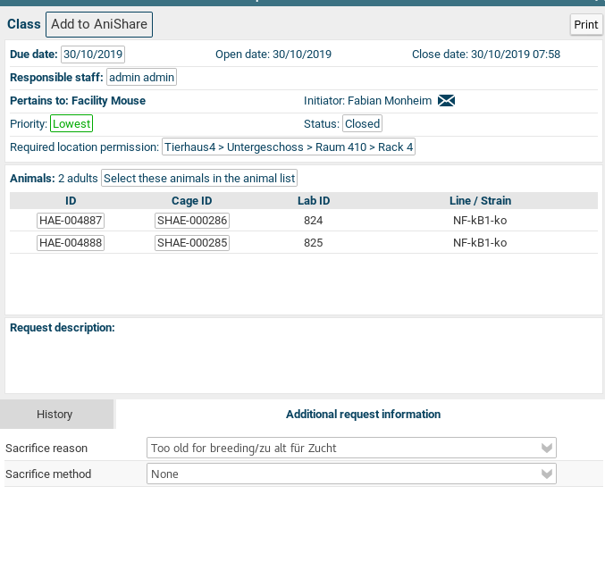
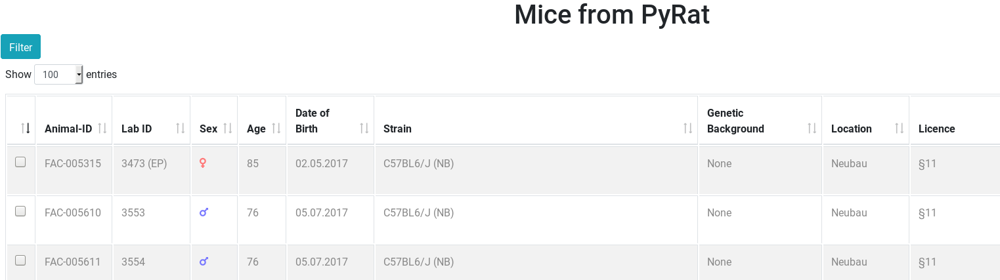
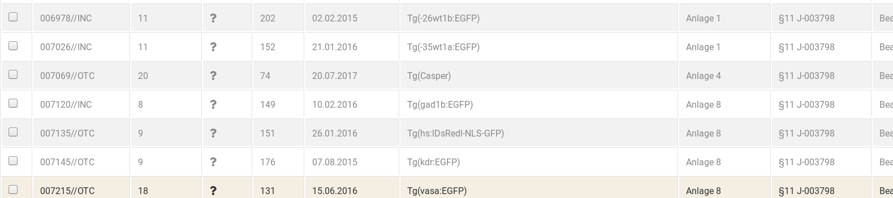
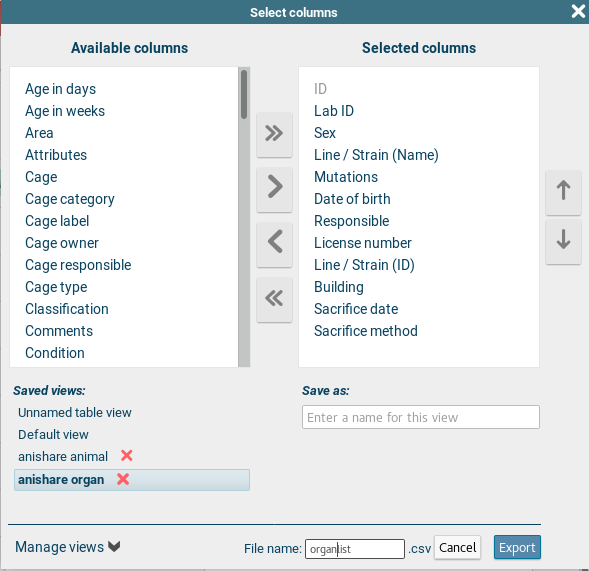
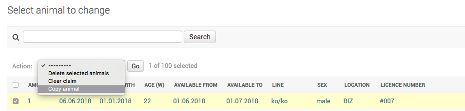

Introduction
============

**anishare** is a webservice for research institutes to share animals
with the goal to re-use animals and thus minimize total animal usage.

It has been developed at the [Leibniz institute for aging
research](http://www.leibniz-fli.de) in Jena. This django app is meant
to be used by researchers who want to share research animals with their
colleagues. The basic idea is that animals are bred for experiments;
however, sometimes, not all parts of the animal are used or sometimes an
experiment gets cancelled for whatever reason. By sharing animals within
the institute, less animals in total have to be sacrificed for research.

Anishare is a simple database of animals offered for reuse and a easy
way to claim an animal with automatic generation of email messages as
well as an RSS feed for updates.

At the moment, the software/database is geared towards handling of mice
and fish, however, it can be adjusted to handle any kind of research
animal. AniShare is connected to import animals from PyRat
or Tick@lab. Until now there is only a special limited
synchronisation back to PyRat. The official changes (e.g.
new ownership must be applied in PyRat or
Tick@lab separately by the responsible person, in
communication with the animal care takers).

This documentation can also be downloaded as pdf file: [Anishare
Documentation](https://anishare.leibniz-fli.de/static/doc/anishare_documentation.pdf)

Contact
=======

Technical and application support: Fabian Monheim (CF Life Science
Computing), <fabian.monheim@leibniz-fli.de>, 03641-65-6872

Content support: Animal Facility and Animal Welfare Officer

License
=======

The software was developed at the Leibniz Institute on Aging - Fritz
Lipmann Institute (FLI; <http://www.leibniz-fli.de/>) under a mixed
licensing model. Researchers at academic and non-profit organizations
can use anishare using the included license, while for-profit
organizations are required to purchase a license. By downloading the
package you agree with conditions of the FLI Software License Agreement
for Academic Non-commercial Research (LICENSE.pdf).

Public demo version
============
You can try a limited version from AniShare using the public instance [https://anishare-demo.leibniz-fli.de](https://anishare-demo.leibniz-fli.de) with the user/password admin.
The demo isn't connected to an animal management system like PyRAT or tick@lab. Because of this, some important functions of AniShare cannot be tried out.

Installation 
============
You can use the docker container [https://hub.docker.com/r/lscit/anishare](https://hub.docker.com/r/lscit/anishare) to test AniShare locally. 
Please note the instructions on the linked website how to run the container.
For productive use we suggest to use the source files, adapt it to your needs and deploy AniShare using apache or gunicorn. 
Please note the installation instructions file (installation_instructions.txt).

Sitemap
=======

-   Start: <https://anishare.leibniz-fli.de>
-   Animal: <https://anishare.leibniz-fli.de/animals>
-   Organ: <https://anishare.leibniz-fli.de/organs>
-   Add mice directly from PyRAT:
    <https://anishare.leibniz-fli.de/animals/micefrompyrat>
-   Add pup directly from PyRAT:
    <https://anishare.leibniz-fli.de/animals/pupfrompyrat>
-   Add fish directly from <tick@lab>:
    <https://anishare.leibniz-fli.de/animals/fishfromtickatlab>
-   Animal and organ feed:
    <https://anishare.leibniz-fli.de/animals/feed>
-   Administration: <https://anishare.leibniz-fli.de/admin>
-   Change history: <https://anishare.leibniz-fli.de/changehistory>
-   Change history feed:
    <https://anishare.leibniz-fli.de/changehistory/feed>

User types
==========

-   User: every FLI employee who wants to claim an animal.
-   Manager: this person is appointed within the research group and
    coordinates the offering/sharing of animals.
-   Person who perform euthanasia: this person will be named in anishare
    by the manager (relevant only for organ sharing).
-   Superuser: this person is administrator of the database and has the
    full control of the function (IT, animal welfare officers,
    veterinarians and heads of animal facilities).

Main user interface
===================

Animals
-------

The main user-facing site is the list of animals to be shared. A user
can browse this list, sort it via the headers or search for a term using
the search bar.

If a user is interested in an animal, they should click on the button
\"Claim\" which will bring up another page (see below) in which they can
review their claim before finally submitting. When they click on \"Yes,
I want to claim this!\", then they will be entered as *new owner* of
this animal and an email will be send to them as well as the
responsible/contact person informing them about this transaction. To
claim more than one animal it is possible to select the desired animals
at the first coloumn. Please use after selection the button **Claim all
selected animals**. Again a new page opens to review the selection.
After submitting the responsible person(s) of the animals only get one
email with their claimed animals. To claim an animal from a fish group
(coloumn \# \> 1) it is nessecary to claim it individualy with the claim
function of the entry (last coloumn).

Note:

If more than one animal is available (coloumn \# \> 1), the user can
adjust the number they want to claim. The remaining animals will still
be available for claim. Because of uniqueness it\'s only possible to
offer exactly one mouse per dataset. In contrast fishes can be offer in
a group.

Organs
------

There exists an individual page for animal organ share. It is very
similar to the animal page, however only individual organs are for
offer. The entry at the column `Organ (used)` indicates all organs which
can not be claimed. Also there is no availability period, but a day at
which the animal gets sacrificed. The person responsible for sacrifice
the animal will be informed via email if anybody claims some of the
available organs. The entry will remain available to others (as they
might want to claim other organs).

Organ index view:

Organ claim view:

RSS Feed
--------

An RSS feed containing the latest ten animals and organs is
automatically generated and can be found at [/animals/feed]{.title-ref}.
Users can subscribe (Most email clients allow the subscription to RSS
feeds) to this feed to stay up-to-date with the animal catalogue. By
clicking on a link in the feed, they are directed to the claim page of
the individual animal/organ.

Main animal manager tasks
=========================

An *animal manager* can add animals and organs to the database on two
ways. First, it is possible to add entrys manually. Secondly, it is
possible to import an Excel sheet. At the FLI Jena there are two
databases to manage animals. Now the databases are not connected. To
transfer more than one or two datasets to anishare it\'s recommend to
use the export function of [PyRAT]{.title-ref} or
[tick\@lab]{.title-ref} and the import function of anishare. To use the
export/import process please read the topic **Animals import** or
**Organs import**.

Add Animals manually
--------------------

Click on `Animals` -\> `Add` to add an animal.

All fields in bold **need** to be filled in, the others are optional.

After adding several animals, the main (index) view should look like
this:

Animals import
--------------

There are several ways to import informations of animals. Using PyRAT
you can create a work request or you can use AniShare to import the
details wich is also possible using <tick@lab>. Both ways will be
explained below.

### From PyRAT

In most cases it is the easiest way to create a work request inside
PyRAT. Select the work request class **Add to AniShare** and add the
animals you like to import. Every hour AniShare searchs after those
requests with status **open**. If the import succeded the status of the
work request change to **Added to AniShare**. Mice are offered two weeks
and pups one week. The import will fail if a mouse has no license or a
mouse has been already offered. If a mouse can not be imported the
creator of the work request gets a email about it and a comment about
will be visible inside the work request. The status of the work request
will change to **Deferred**, if no animal could be imported.

The creator of the work request gets a email about it two days before
the offer time ends. The status of the request time will be set to
**close** after the offer time.

Another way to import animals from PyRAT is to use the website [Add
Mice](https://anishare.leibniz-fli.de/animals/micefrompyrat/) or for
pups [Add Pup](https://anishare.leibniz-fli.de/animals/pupfrompyrat).
The user has the same rights as in PyRAT. It means the user has access
to all animals as in PyRAT and the user must have a PyRAT account. If
the user in PyRAT has the role `Animal facility staff` or
`Administrator` the user will only see the data after searching (filter)
an owner or a responsible person of the animals.

To import the animals please select / activate the animals (rows) and
push the button `Import mouse/mice to AniShare`. You find the button on
the left side below the table. Now it\'s possible to change the default
offering period (mouse = 14 days, pup = 7 days) and to add a second
responsible person. The second responsible person gets a mail too if the
animals was claimed. After checking the informations the import runs
after pushing the button `Yes, I want to offer these mice!`. After
import you switch automatically to the administration area of AniShare
und you can see the imported animals if the import successful. If an
import failed you see an error message and the AniShare admin gets a
mail about it. One last hint: It\'s only possible to import an animal
once only.

### From [tick\@lab]{.title-ref}

In most cases it is the easiest way to use the website [Add
Fish](https://anishare.leibniz-fli.de/animals/fishfromtickatlab/). The
user has the same rights as in PyRAT. It means the user has access to
all animals as in <tick@lab> and the user must have a <tick@lab>
account.

To import the animals please select / activate the animals (rows) and
push the button `Import Fishs to AniShare`. You find the button on the
left side below the table. Now it\'s possible to change the default
offering period (14 days) and to add a second responsible person. The
second responsible person gets a mail too if the animals was claimed.
After checking the informations the import runs after pushing the button
`Yes, I want to offer these fishes!`. After import you switch
automatically to the administration area of AniShare und you can see the
imported animals if the import successful. If an import failed you see
an error message and the AniShare admin gets a mail about it. One last
hint: It\'s only possible to import an animal once only.

Add Organs manually
-------------------

Click on `Organs` -\> `Add` to add an organ.

All fields in bold **need** to be filled in, the others are optional.

Organs import
-------------

### From PyRAT

First login to PyRAT and **switch to the english version** of PyRAT if
it is no preset. Then select the animals which should be import to
anishare. Click on `QS` (Quick Select) and activate the option
`Export this list to Excel`. Push the button `Apply`.

Now it\'s important to select all mandatory fields: **ID, Lab ID, Sex,
Line / Strine (Name), Mutations, Date of birth, Responsible, License
number, Building, Sacrifice date, Sacrifice method**

It\'s possible to save the selected columns as a `Manage View` for reuse
(fold out `Manage View` on the left side of the `File name`)

After downloading the file it\'s nessecary to edit the file because the
coloumns **Animal type, Euthanasia performed by, Comment** are missing.
Furthermore the format of the coloumn **Sacrifice date** needs to be
adapt. To simplify this process there are macros for LibreOffice and MS
Office. The macros automatically add the missing coloumns and add the
value `mouse` at coloumn **Animal type** Please refeer to the [macro
site](https://anishare.leibniz-fli.de/macros/) to downloading the macros
and further informations.

After running the macro it\'s possible to fill out the coloumn
**Sacrifice method** with one of the following entries: **CO2, cervicale
dislocation, decapitation, blood withdrawl, finale heart punction,
overdose anaesthetics, other** and the coloumn **Organ used** with the
following entries: **bladder, bone marrow, brain, genitals, heart,
intestine, kidney, liver, lungs, other, spleen, stomatch** It\'s also
possible to add this entries after uploading the file.

Note:

It\'s possible to add more than one entry at the field **Organ used**.
Please use a comma as seperator like `brain, bladder`.

Please save the Excel file as .xlsx file. Now go to the anishare admin
interface to `Home › Animals › Animals` and click the button `IMPORT`
(above the filter). Select the file and choose the file format. Upload
the file. After submitting all datasets will show to the user if all
requirements match.

### From [tick\@lab]{.title-ref}

Because we expect only a small quantity of importing organs from
[tick\@lab]{.title-ref} it\'s only possible to add entries manually.

Duplicating entries
-------------------

For input of multiple similar entries, it is possible to duplicate an
animal or organ entry. For this, select one or more entries in the list
(see figure below) and select \"[copy animal]{.title-ref}\" from the
dropdown menu and click \"[Go]{.title-ref}\".

Another option is to edit an existing animal and click on \"[Save as
new]{.title-ref}\". This will save the currently edited animal as a new
instance:

Main administrator tasks
========================

The administrator can edit more objects in the admin interface, namely
not just animals and organs but also labs, locations and persons:

Organs used
-----------

These organs are standard values for the field **Organ used**.

Animals
-------

The main category to administer are animals to share. Here, several
filters (such as \"sex\", \"location\", etc.) are available to search
for any set of animals.

Note:
in order to remove a claim (thus making the animal available again),
either click on an animal and remove the email address from the field
\"new owner\", or select one or multiple animals and select the \"clear
claim\" *Action* and click \"Go\".

Note:

Once created, an animal cannot be deleted, except by the administrator.

Labs
----

Labs are research labs/research groups and need to have at least one
responsible/contact person each

Note:

Only *administrators* are allowed to see and change Labs:

Locations
---------

Locations are where animals are stored. Usually something like room
numbers or \"animal house\" or \"fish facility\".

Note:
Only *administrators* are allowed to see and change Locations

Persons
-------

Persons responsible for the animals. Could be a vet or similar. Every
animal needs to have a responsible person associated to them. This
person then gets an email when the animal is being claimed.

Note:
Only *administrators* are allowed to see and change Persons

Make a user an animal manager
-----------------------------

The *administrator* is also responsible for user/rights management. In
order to be able to add/edit animals, a user has to be in the group
*animal manager* and have *staff status* in the django admin interface.
For this, an *administrator* has to go to the [user
management](https://anishare.leibniz-fli.de/admin/auth/user/) in the
admin interface by clicking \"Home\" -\> \"Authentication and
Authorization\" -\> \"Users\". Here, they can make a *user* an *animal
manager*, by setting these values (*staff* and group *animal manager*):

Anishare change history
-----------------------

New functions and bugfix at the system should be documented. So users
can be informed about changes on the system. All changes are visible to
authenticated users. Please refeer to the site [AniShare Change
History](https://anishare.leibniz-fli.de/changehistory/) to see all
changes. Furthermore it\'s possible to subscribe to the [Anishare
Version Feed](https://anishare.leibniz-fli.de/changehistory/feed) to
stay informed.

UML Model
---------

Enter `python manage.py graph_models` to get an updated uml model.

