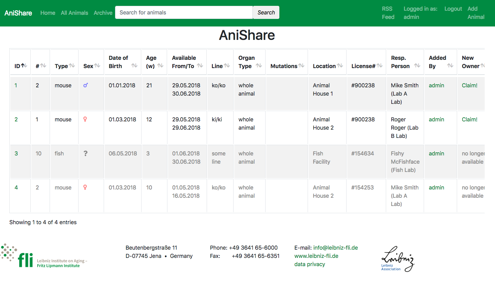
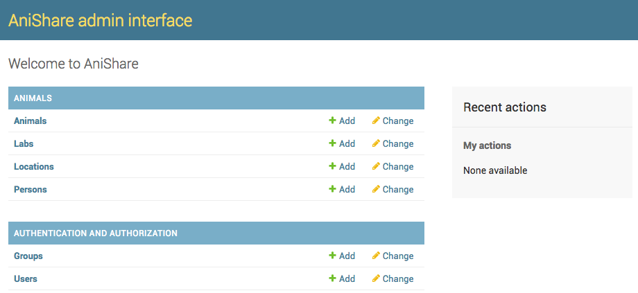

.. anishare documentation master file, created by
   sphinx-quickstart on Tue May 29 13:02:59 2018.
   You can adapt this file completely to your liking, but it should at least
   contain the root `toctree` directive.

Welcome to anishare's documentation!
====================================

.. toctree::
   :maxdepth: 2
   :caption: Contents:

Introduction
------------

**anishare** is a webservice for research institutes to share animals with the goal to minimize animal usage.

It has been developed by Holger Dinkel at the `Leibniz institute for aging research <http://leibniz-fli.de>`_ in Jena.
This django app is meant to be used by researchers who want to share research animals with their colleagues. 
The basic idea is that animals are bred for experiments; however, often, not all parts of the animal are used or sometimes 
an experiment gets cancelled for whatever reason.
By sharing animals within the institute, less animals in total have to be sacrificed for research.

Anishare is a simple database of animals offered for reuse and a easy way to claim an animal with automatic generation 
of email messages as well as an RSS feed for updates.

At the moment, the software/database is geared towards handling of mice, however, it can be adjusted to handle any kind of research animal.

Installation
------------

Requirements
^^^^^^^^^^^^
We use the latest version of `django <https://www.djangoproject.com>`_, which requires `python3 <https://www.python.org>`_.
Install django and other dependancies (see file requirements.txt. We recommend using a virtual environment for this)::

    virtualenv -p python3 .
    source bin/activate
    pip install -r requirements.txt

First time setup
^^^^^^^^^^^^^^^^

First, in the folder ``anishare``, copy the file ``local_settings.py.template``
to ``local_settings.py`` and fill it in. If you want to use LDAP, comment in
the respective lines. Most importantly, you should configure the following lines::

    EMAIL_HOST = ''
    SECRET_KEY = ''
    ALLOWED_HOSTS = ['127.0.0.1', ]

Then, you can run migrations::

    python manage.py migrate

.. note:: This will create the sqlite database ``db.sqlite3`` containing all the models 
          (eg. tables) as defined in :py:mod:`animals.models`.

.. :py:class:`animals.models.Animal`

.. .. currentmodule:: animals.views
.. .. autofunction:: claim

Now create a superuser::

    python manage.py createsuperuser

You are now able to login to the admin interface, but first run the dev server::

    python manage.py runserver

This will listen on ``http://localhost:8000``, so browse to the admin page 
``http://localhost:8000/admin`` and you should see this after login:

Click on ``Animals`` -> ``Add`` to add an animal.

.. image:: img/admin_add_animal.png
   :width: 50%

After adding several animals, the main (index) view should look like this:

.. image:: img/admin_after_loaddata.png

.. Note:: Alternatively, you can also import a dummy set of data using the ``loaddata`` command:

::

   python manage.py loaddata initial_data.json

Importing existing data
^^^^^^^^^^^^^^^^^^^^^^^
For import of existing data in tabular (excel) format, a management command is available at::
   
   python manage.py import_animals

.. Note:: See the file ``example_import.xls`` for an example...

Running Tests
-------------
Tests reside in ``animals/tests.py``.
You can invoke the django tests like so::

    python manage.py test

API documentation
==================

.. include::   modules/admin.rst
.. include::   modules/models.rst
.. include::   modules/views.rst
.. include::   modules/urls.rst

.. Indices and tables
.. ==================
.. * :ref:`genindex`
.. * :ref:`modindex`
.. * :ref:`search`
