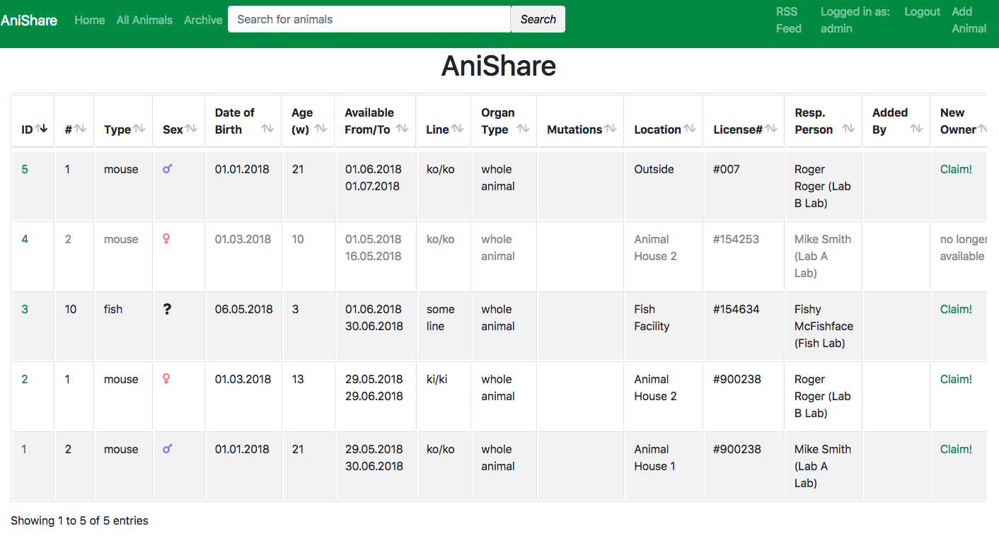
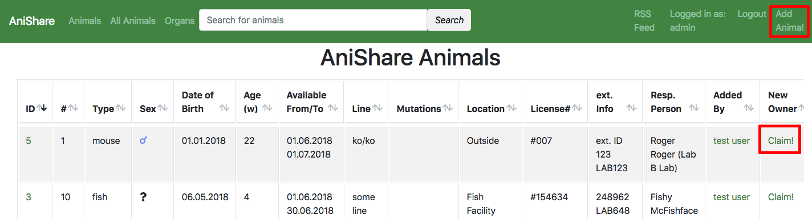
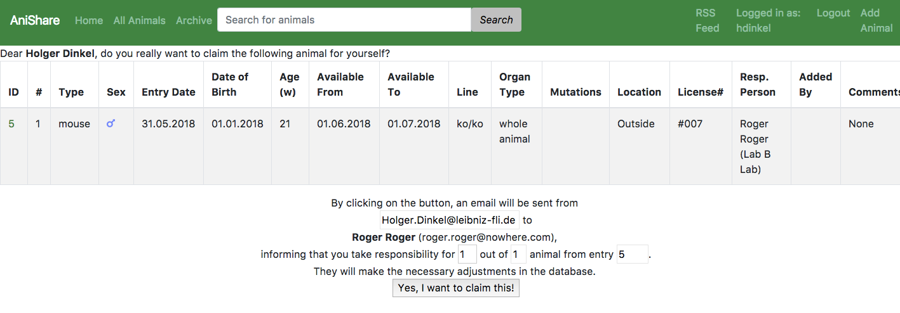
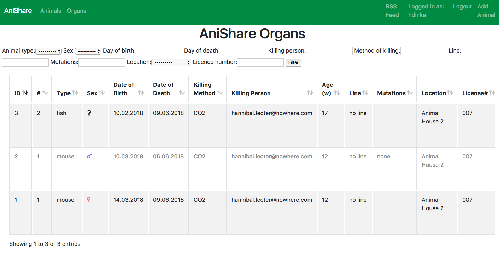
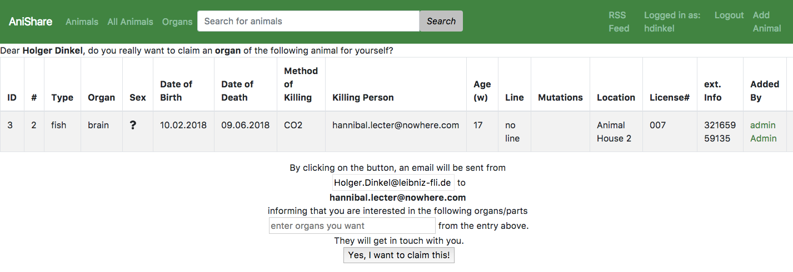
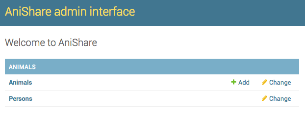
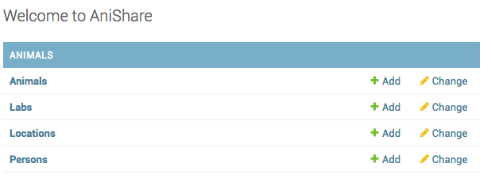
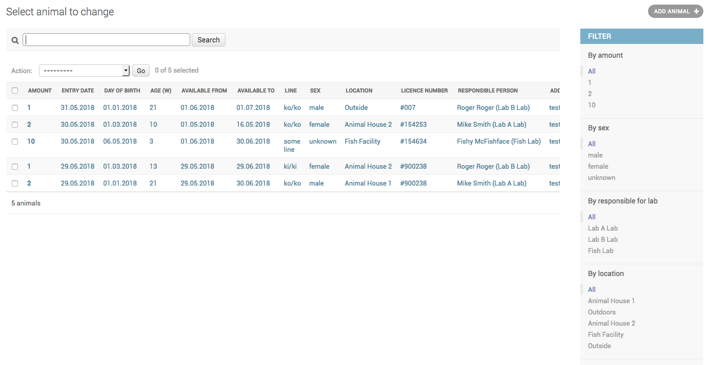
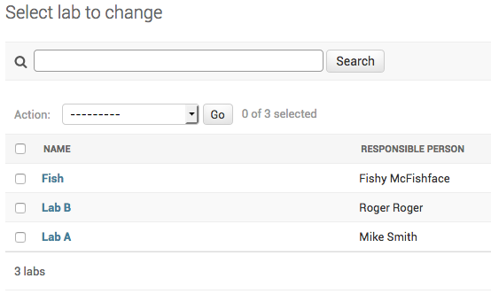
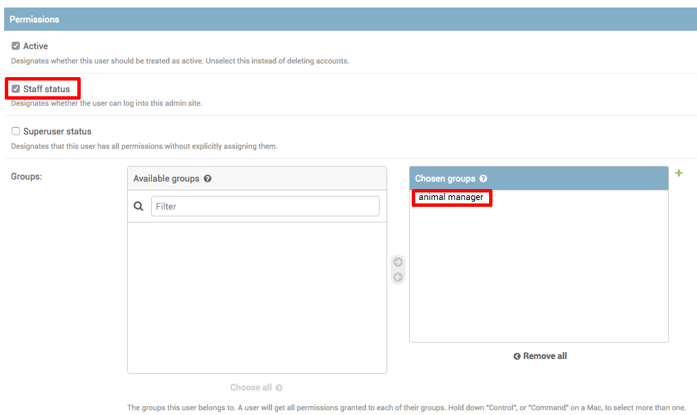

.. anishare documentation master file, created by
   sphinx-quickstart on Tue May 29 13:02:59 2018.
   You can adapt this file completely to your liking, but it should at least
   contain the root `toctree` directive.

Welcome to the documentation of anishare !
==========================================

.. toctree::
   :maxdepth: 2
   :caption: Contents:

Introduction
------------

**anishare** is a webservice for research institutes to share animals with the goal to re-use
animals and thus minimize total animal usage.

It has been developed at the `Leibniz institute for aging research <http://leibniz-fli.de>`_ in
Jena. This django app is meant to be used by researchers who want to share research animals with
their colleagues. The basic idea is that animals are bred for experiments; however, sometimes, not
all parts of the animal are used or sometimes an experiment gets cancelled for whatever reason. By
sharing animals within the institute, less animals in total have to be sacrificed for research.

Anishare is a simple database of animals offered for reuse and a easy way to claim an animal with
automatic generation of email messages as well as an RSS feed for updates.

At the moment, the software/database is geared towards handling of mice, however, it can be adjusted
to handle any kind of research animal.

Installation
------------

Requirements
^^^^^^^^^^^^

We use the latest version of `django <https://www.djangoproject.com>`_, which requires `python3 <https://www.python.org>`_. 
Install django and other dependancies (see file requirements.txt. We recommend using a virtual environment for this)::

    virtualenv -p python3 .
    source bin/activate
    pip install -r requirements.txt

First time setup
^^^^^^^^^^^^^^^^

First, in the folder ``anishare``, copy the file ``local_settings.py.template``
to ``local_settings.py`` and fill it in. If you want to use LDAP, comment in
the respective lines. Most importantly, you should configure the following lines::

    EMAIL_HOST = ''
    SECRET_KEY = ''
    ALLOWED_HOSTS = ['127.0.0.1', ]

Then, you can run migrations::

    python manage.py migrate

.. note:: This will create the sqlite database ``db.sqlite3`` containing all the models 
          (eg. tables) as defined in :py:mod:`animals.models`.

Now create a superuser::

    python manage.py createsuperuser

You are now able to login to the admin interface, but first run the dev server::

    python manage.py runserver

This will listen on ``http://localhost:8000``, so browse to the admin page 
``http://localhost:8000/admin`` and you should see this after login:

.. image:: img/admin_empty.png

You can also import a dummy set of data using the ``loaddata`` command::

   python manage.py loaddata initial_data.json

After loading the data, the main admin interface should look like this:

.. image:: img/admin_after_loaddata.png

Importing existing data
^^^^^^^^^^^^^^^^^^^^^^^
For import of existing data in tabular (excel) format, a management command is available at 
:py:mod:`animals.models`.
:py:mod:`animals.management.commands.import_animals` ::
   
   python manage.py import_animals

.. Note:: See the file ``example_import.xls`` for an example...
.. image:: img/import_excel_sheet.png

Running Tests
^^^^^^^^^^^^^
Tests reside in ``animals/tests.py``.
You can invoke the django tests like so::

    python manage.py test

.. literalinclude:: ../animals/tests.py
   :language: python
   :linenos:

Using the software
------------------

The webservice is split in two parts: The **animal input** method is via the Django Admin interface (See link
"Add Animal" top right) and is meant for *animal managers* only. 
The **claim** method is via the normal web interface and is meant for normal users (who need to be
authenticated, though).

Main user interface
^^^^^^^^^^^^^^^^^^^

Animals
"""""""

The main user-facing site is the list of animals to be shared. A user can browse this list, sort it
via the headers or search for a term using the search bar.

If a user is interested in an animal, they should click on the button "Claim" which will bring up
another page (see below) in which they can review their claim before finally submitting. When they
click on "Yes, I want to claim this!", then they will be entered as *new owner* of this animal and
an email will be send to them as well as the responsible/contact person informing them about this
transaction. Further steps might need to be necessary such as transferring the animal in the LIMS
(eg. PyRat).

.. Note:: If more than one animal is available, the user can adjust the number they want to claim.
          The remaining animals will still be available for claim.

Organs
""""""

There exists an individual page for animal organ share. It is very similar to the animal page,
however only individual organs are for offer. Also there is no availability period, but a day at
which the animal gets sacrificed. The person responsible for killing the animal will be informed via
email if anybody claims some of the available organs. The entry will remain available to others (as
they might want to claim other organs).

Organ index view:

Organ claim view:

RSS Feed
""""""""

An RSS feed containing the latest ten animals and organs is automatically generated and can be found at
`/animals/feed`. Users can subscribe (Most email clients allow the subscription
to RSS feeds) to this feed to stay up-to-date with the animal catalogue. By clicking on a link in
the feed, they are directed to the claim page of the individual animal/organ.

.. image:: img/anishare_rss_feed.png
   :width: 50%

Main animal manager tasks
^^^^^^^^^^^^^^^^^^^^^^^^^
An *animal manager* can add animals to the database.

Click on ``Animals`` -> ``Add`` to add an animal.

.. image:: img/admin_add_animal.png
   :width: 40%

All fields in bold **need** to be filled in, the others are optional.

After adding several animals, the main (index) view should look like this:

.. image:: img/admin_after_loaddata.png

Main admin tasks
^^^^^^^^^^^^^^^^
The admin interface allows to edit the following types of entries:

Animals
""""""

The main category to administer are animals to share.
Here, several filters (such as "sex", "location", etc.) are available to search for any set of animals.

.. Note:: in order to remove a claim (thus making the animal available again), either click on an animal 
          and remove the email address from the field "new owner", or select one or multiple animals and 
          select the "clear claim" *Action* and click "Go".
.. Note:: Once created, an animal cannot be deleted, except by the administrator.

Labs
""""

Labs are research labs/research groups and need to have at least one responsible/contact person each

.. Note:: Only *administrators* are allowed to see and change Labs

Locations
"""""""""

Locations are where animals are stored. Usually something like room numbers or "animal house" or "fish facility".

.. image:: img/admin_locations.png
   :width: 60%

.. Note:: Only *administrators* are allowed to see and change Locations

Persons
"""""""

Persons responsible for the animals. Could be a vet or similar.
Every animal needs to have a responsible person associated to them. This person then gets
an email when the animal is being claimed.

.. image:: img/admin_persons.png

.. Note:: Only *administrators* are allowed to see and change Persons

Make a user an animal manager
"""""""""""""""""""""""""""""

In order to be able to add/edit animals, a user has to be in the group *animal manager* and have
*staff status* in django admin. For this, an *administrator* has to go to the `user management
<https://anishare.leibniz-fli.de/admin/auth/user/>`_ in the admin interface by clicking "Home" -> "Authentication and
Authorization" -> "Users". Here, they can make a *user* an *animal manager*, by setting these values (*staff*
and group *animal manager*):

Upgrading django
"""""""""""""""
To upgrade django or any other python library for anishare, go into the anishare directory, and
activate its virtualenv::

   cd anishare
   source bin/activate

Next, install/upgrade whatever library (here: django to the latest version)::

   pip install --upgrade django

.. Note:: It's best to test the latest version in a local/development environment first!

Upgrading python
""""""""""""""""
When upgrading the python version of the host operating system, it might be necessary to also
upgrade the python in the virtualenv. Otherwise an error like the following might occur:

   ``python: error while loading shared libraries: libpython3.4m.so.1.0: cannot open shared object file: No such file or directory``

In that case, go into the anishare directory, and delete the following directories:

- bin
- include
- lib
- lib64

Afterwards, create a new virtualenv and install the required libraries like so::

    virtualenv -p python3 .
    source bin/activate
    pip install -r requirements.txt

API documentation
==================

.. include::   modules/admin.rst
.. include::   modules/models.rst
.. include::   modules/views.rst
.. include::   modules/urls.rst

.. Indices and tables
.. ==================
.. * :ref:`genindex`
.. * :ref:`modindex`
.. * :ref:`search`
